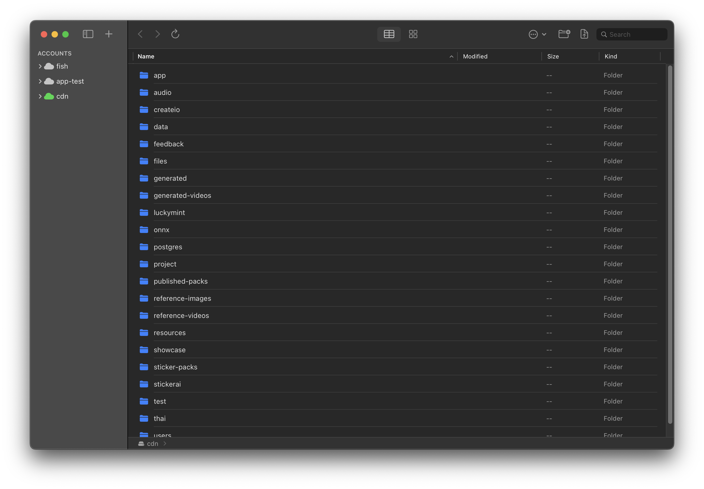

<p align="center">
  
</p>

<h1 align="center">OwlUploader</h1>

<p align="center">
  A native macOS client for <strong>Cloudflare R2</strong> object storage.<br>
  Built with SwiftUI. Designed for developers and content creators.
</p>

<p align="center">
  <a href="https://github.com/sanvibyfish/OwlUploader/releases/latest">
    
  </a>
</p>

<p align="center">
  <a href="#features">Features</a> &bull;
  <a href="#screenshots">Screenshots</a> &bull;
  <a href="#build-from-source">Building</a> &bull;
  <a href="README_ZH.md">中文文档</a>
</p>

---

## Screenshots

### File Browser
Finder-style table view with multi-account sidebar, column sorting, and breadcrumb navigation.



## Features

### Connection Management
- Multiple Cloudflare R2 accounts with quick switching
- Secure credential storage via macOS Keychain
- Real-time connection status monitoring

### Bucket Operations
- Browse and manage all accessible R2 buckets
- Custom public domain configuration (multiple domains supported)
- CDN cache purge via Cloudflare API

### File Management
- **Upload** — Drag & drop, folder upload, batch upload with conflict detection
- **Download** — Single file, batch, and folder download
- **Delete** — Single & batch deletion with optimized batch API
- **Rename** — Files and folders with real-time validation
- **Move** — Right-click to move between directories, batch support
- **Preview** — Image, video, audio, PDF, and text formats
- **Copy Link** — One-click copy; multi-domain submenu when configured

### Advanced
- Finder-style forward/backward navigation history
- Multi-select: Cmd+Click to add, Shift+Click for range
- Search, type filter, and column sorting
- Upload / download / move queues with cancel & retry
- Automatic task deduplication
- Upload conflict resolution (Replace / Keep Both / Skip)
- CDN cache auto-purge on overwrite upload

### User Experience
- Native macOS design (SwiftUI)
- Finder-style Table View and Icon View
- Breadcrumb navigation
- Dark mode support
- English and Simplified Chinese localization

## System Requirements

| Requirement | Minimum |
|-------------|---------|
| macOS | 15.4+ |
| Architecture | Intel & Apple Silicon |
| Network | Stable internet connection |

## Tech Stack

- **Language**: Swift 5.9+
- **UI**: SwiftUI
- **Networking**: AWS SDK for Swift (S3-compatible API)
- **Security**: macOS Keychain Services
- **Architecture**: MVVM + ObservableObject

## Build from Source

```bash
git clone https://github.com/sanvibyfish/OwlUploader.git
cd OwlUploader
open OwlUploader.xcodeproj
```

- Xcode 16.0+
- Select Mac target, press `Cmd + R`

## Getting Started

1. Launch OwlUploader and open **Account Settings**
2. Enter your Cloudflare R2 credentials:
   - **Account ID** (from Cloudflare dashboard)
   - **Access Key ID** & **Secret Access Key** (R2 API token)
   - **Endpoint URL**: `https://[AccountID].r2.cloudflarestorage.com`
3. Click **Save and Connect**
4. Optionally add public domains for link generation

## Security

- Credentials stored in macOS Keychain (not in plain text)
- App Sandbox enabled
- All network traffic over HTTPS
- No data sent to third-party servers

## Contributing

1. Fork this repository
2. Create a feature branch (`git checkout -b feature/amazing-feature`)
3. Commit your changes
4. Push and open a Pull Request

**Guidelines**: Follow Swift conventions. Keep files under 500 lines. Add tests for new features.

## License

[GNU GPL v3](LICENSE)

## Acknowledgments

- [AWS SDK for Swift](https://github.com/awslabs/aws-sdk-swift) — S3-compatible API
- [Cloudflare R2](https://developers.cloudflare.com/r2/) — Object storage

## Feedback

- [GitHub Issues](https://github.com/sanvibyfish/OwlUploader/issues)
- Email: sanvibyfish@gmail.com
