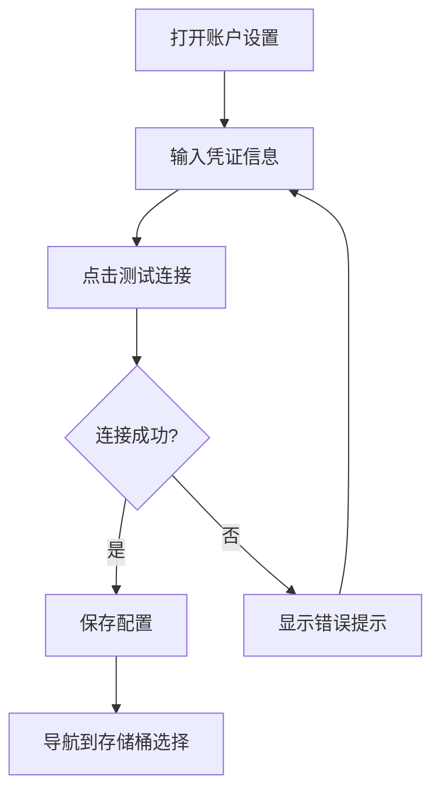

# 01. 账户配置 (Account Configuration)

## 功能概述

账户配置模块允许用户配置和管理 Cloudflare R2 账户凭证，包括 Account ID、Access Key ID、Secret Access Key 和 Endpoint URL。

## 核心组件

| 文件 | 职责 |
|------|-----|
| `AccountSettingsView.swift` | 账户配置 UI 界面 |
| `R2AccountManager.swift` | 账户状态管理 |
| `R2Account.swift` | 账户数据模型 |
| `KeychainService.swift` | 敏感凭证安全存储 |

## 功能特性

### ✅ 已实现

- **凭证输入表单**: Account ID、Access Key ID、Secret Access Key、Endpoint URL
- **默认存储桶配置**: 可设置默认连接的存储桶名称
- **公共域名配置**: 用于生成文件公开访问链接
- **连接测试**: 验证凭证有效性
- **安全存储**: Secret Access Key 使用 Keychain 加密存储
- **账户状态指示**: 实时显示连接状态

### 📋 配置字段

| 字段 | 必填 | 说明 |
|------|:----:|------|
| Account ID | ✓ | Cloudflare 账户 ID |
| Access Key ID | ✓ | R2 API 访问密钥 ID |
| Secret Access Key | ✓ | R2 API 访问密钥 (Keychain 存储) |
| Endpoint URL | ✓ | 格式: `https://[账户ID].r2.cloudflarestorage.com` |
| 默认存储桶 | ✗ | 启动时自动连接的存储桶 |
| 公共域名 | ✗ | 用于生成公开链接 |

## 用户交互流程



## 技术实现

### 状态管理

```swift
@State private var accountID: String = ""
@State private var accessKeyID: String = ""
@State private var secretAccessKey: String = ""
@State private var endpointURL: String = ""
@State private var connectionTestResult: ConnectionTestResult = .none
```

### 验证逻辑

- Account ID: 非空验证
- Access Key ID: 非空验证
- Secret Access Key: 非空验证
- Endpoint URL: URL 格式验证

## 相关链接

- [安全存储 (Keychain)](./07-security-keychain.md)
- [系统诊断](./08-diagnostics.md)
