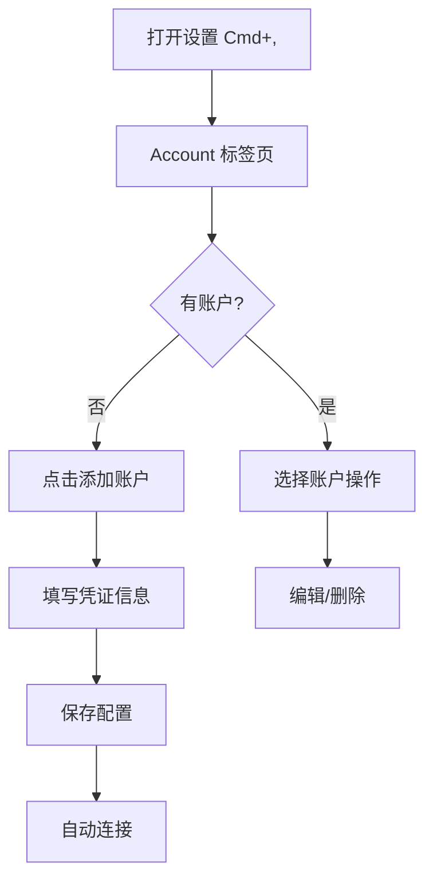

# 01. 账户配置 (Account Configuration)

## 功能概述

账户配置模块允许用户配置和管理 Cloudflare R2 账户凭证，包括 Account ID、Access Key ID、Secret Access Key 和 Endpoint URL。

## 核心组件

| 文件 | 职责 |
|------|-----|
| `AccountSettingsView.swift` | 账户配置 UI 界面（原生 TabView 风格） |
| `R2AccountManager.swift` | 账户状态管理 |
| `R2Account.swift` | 账户数据模型 |
| `KeychainService.swift` | 敏感凭证安全存储 |

## 设置窗口设计

### macOS 原生 Settings Scene

应用使用 SwiftUI 原生 `Settings` scene，提供标准的 macOS 设置体验：

```swift
// OwlUploaderApp.swift
var body: some Scene {
    WindowGroup {
        ContentView()
    }

    Settings {
        AccountSettingsView()
            .environmentObject(R2Service.shared)
            .environmentObject(R2AccountManager.shared)
            .environmentObject(MessageManager())
    }
}
```

**特性：**
- 标准窗口控件（红黄绿按钮）
- `Cmd + ,` 快捷键自动支持
- 独立窗口，可自由移动和关闭

### TabView 布局

设置页面使用原生 `TabView` 分类显示：

```
┌─────────────────────────────────────────┐
│ ● ○ ○                                   │
├─────────────────────────────────────────┤
│  [Account] [General] [About]            │  ← TabView
├─────────────────────────────────────────┤
│                                         │
│  账户列表 / 通用设置 / 关于信息          │
│                                         │
└─────────────────────────────────────────┘
```

| 标签页 | 图标 | 内容 |
|--------|:----:|------|
| Account | `person.crop.circle` | 账户列表管理 |
| General | `gearshape` | 主题、语言、并发设置 |
| About | `info.circle` | 应用信息、版本号 |

## 功能特性

### ✅ 已实现

- **凭证输入表单**: Account ID、Access Key ID、Secret Access Key、Endpoint URL
- **默认存储桶配置**: 可设置默认连接的存储桶名称
- **公共域名配置**: 用于生成文件公开访问链接（缩略图依赖）
- **连接测试**: 验证凭证有效性
- **安全存储**: Secret Access Key 使用 Keychain 加密存储
- **账户状态指示**: 实时显示连接状态
- **多账户管理**: 支持添加、编辑、删除多个账户

### 📋 配置字段

| 字段 | 必填 | 说明 |
|------|:----:|------|
| Account ID | ✓ | Cloudflare 账户 ID |
| Access Key ID | ✓ | R2 API 访问密钥 ID |
| Secret Access Key | ✓ | R2 API 访问密钥 (Keychain 存储) |
| Endpoint URL | ✓ | 格式: `https://[账户ID].r2.cloudflarestorage.com` |
| Display Name | ✗ | 自定义显示名称 |
| 公共域名 | ✗ | 用于生成公开链接和缩略图 |

## 用户交互流程



## 通用设置 (General)

### 外观设置

| 设置项 | 选项 | 说明 |
|-------|------|------|
| 主题 | System / Light / Dark | 界面主题模式 |
| 语言 | 中文 / English | 界面语言（需重启） |

### 并发设置

| 设置项 | 范围 | 默认值 | 说明 |
|-------|------|--------|------|
| 并发上传数 | 1-50 | 5 | 同时上传的文件数量 |
| 并发移动数 | 1-10 | 3 | 同时移动的文件数量 |

使用原生 `Stepper` 控件：

```swift
Stepper(value: $concurrentUploads, in: 1...50, step: 1) {
    HStack {
        Text("Concurrent Uploads")
        Spacer()
        Text("\(Int(concurrentUploads))")
            .foregroundColor(.secondary)
            .monospacedDigit()
    }
}
```

## 关于页面 (About)

居中展示应用信息：

```
┌────────────────────────────────────┐
│                                    │
│           [应用图标]               │
│                                    │
│         OwlUploader                │
│      Version 1.0.0 (1)             │
│                                    │
│   Cloudflare R2 文件管理工具        │
│                                    │
│  © 2025 OwlUploader. All rights    │
│           reserved.                │
└────────────────────────────────────┘
```

**特性：**
- 真实应用图标 (`NSApplication.shared.applicationIconImage`)
- 动态版本号（从 Bundle 获取）
- 版权信息

## 账户编辑优化

### 用户体验改进

- **异步保存**: Keychain 操作在后台执行，不阻塞主线程
- **状态反馈**: 保存/测试过程中禁用表单，显示加载指示器
- **平滑动画**: 状态切换使用平滑过渡动画
- **错误处理**: 操作失败时重置状态并显示错误信息

### 公共域名配置提示

在公共域名配置区域显示功能提示：

```
⚠️ 缩略图预览需要配置公共域名，否则 Table/Icons 视图中的缩略图将无法显示。

在 Cloudflare R2 控制台 → 存储桶设置 → 公共访问 中配置公共域名
```

## 相关链接

- [安全存储 (Keychain)](./07-security-keychain.md)
- [系统诊断](./08-diagnostics.md)
- [Finder UI 设计规范](./09-finder-ui-design.md)
