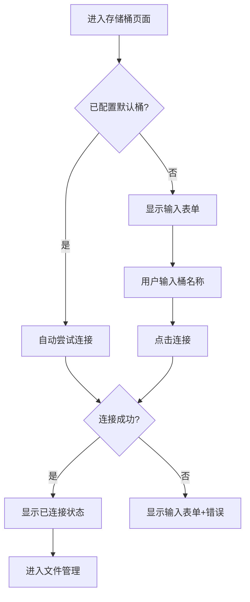

# 02. 存储桶操作 (Bucket Operations)

## 功能概述

存储桶操作模块提供 R2 存储桶的选择和连接功能。用户可以手动输入存储桶名称进行连接，或使用预配置的默认存储桶自动连接。

## 核心组件

| 文件 | 职责 |
|------|-----|
| `BucketListView.swift` | 存储桶选择 UI 界面 |
| `BucketItem.swift` | 存储桶数据模型 |
| `R2Service.swift` | 存储桶 API 交互 |

## 功能特性

### ✅ 已实现

- **手动输入连接**: 通过输入存储桶名称连接
- **自动连接**: 使用配置的默认存储桶自动连接
- **连接状态显示**: 实时显示当前连接状态
- **切换存储桶**: 断开当前连接并选择新存储桶
- **错误处理**: 连接失败时显示详细错误信息

## 用户界面状态

### 未连接状态
显示提示信息，引导用户前往账户设置配置凭证。

### 正在连接状态
显示加载指示器和当前尝试连接的存储桶名称。

### 已连接状态
显示成功图标、已连接的存储桶名称，并提供以下操作：
- **进入文件管理**: 跳转到文件列表页面
- **切换存储桶**: 断开当前连接，重新选择

## 交互流程



## API 方法

### 选择存储桶
```swift
func selectBucket(_ bucket: BucketItem) async throws
```

### 获取存储桶信息
```swift
func listBuckets() async throws -> [BucketItem]
```

## 数据模型

```swift
struct BucketItem: Identifiable, Hashable {
    let id: UUID
    let name: String
    let creationDate: Date?
}
```

## 相关链接

- [账户配置](./01-account-configuration.md)
- [文件导航](./03-file-navigation.md)
