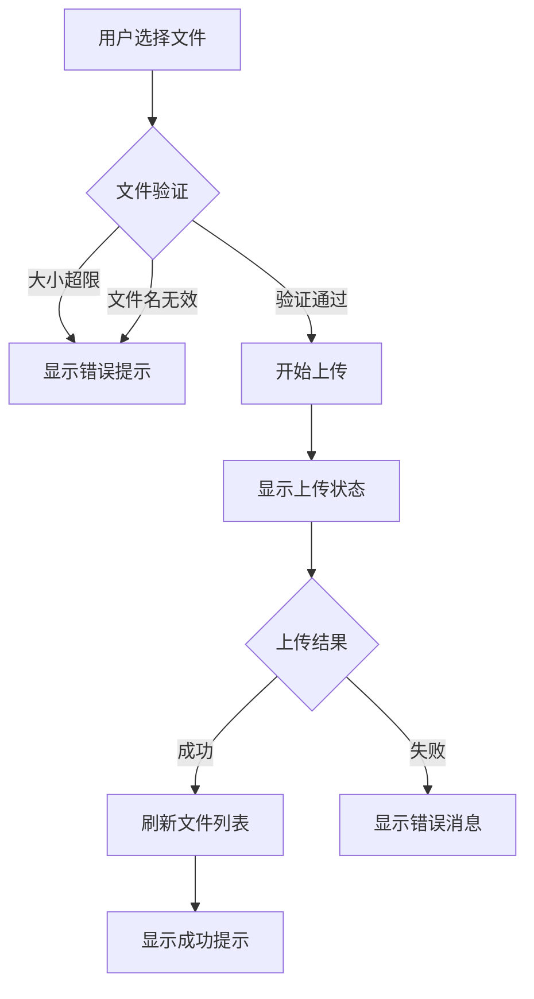
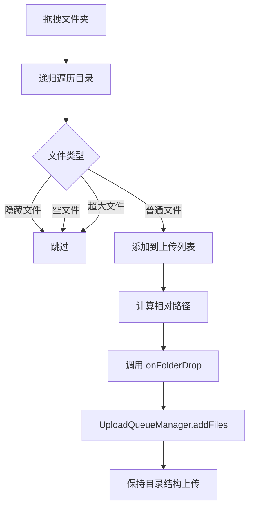

# 04. 文件上传 (File Upload)

## 功能概述

文件上传模块支持多种方式将本地文件上传到 R2 存储：文件选择器、拖拽上传和文件夹上传。上传的文件会保存到当前浏览的目录路径下。

## 核心组件

| 文件 | 职责 |
|------|-----|
| `FileListView.swift` | 上传按钮与文件选择器 |
| `FileDropView.swift` | 拖拽上传 NSView 组件 |
| `UploadQueueManager.swift` | 上传队列管理 |
| `UploadQueueView.swift` | 上传队列 UI |
| `R2Service.swift` | 文件上传 API |

## 功能特性

### ✅ 已实现

- **文件选择器上传**: 通过系统文件对话框选择文件
- **拖拽上传**: 将文件拖入列表区域自动上传
- **文件夹上传**: 拖拽文件夹，保持目录结构上传
- **批量上传**: 支持同时上传多个文件
- **上传队列**: 可视化上传进度和队列管理
- **并发控制**: 支持 1-10 个文件同时上传（默认 5 个）
- **并发配置**: 可在设置页面调整并发上传数
- **真正并行**: 多个文件真正同时上传，非串行执行
- **上传状态显示**: 显示上传进度和状态
- **自动刷新**: 上传完成后自动刷新文件列表
- **无阻塞 UI**: 上传过程中不阻塞用户操作界面
- **错误处理**: 上传失败时显示详细错误信息
- **失败重试**: 支持重试失败的上传任务

### 📋 上传限制

| 限制项 | 值 | 说明 |
|-------|-----|------|
| 最大文件大小 | 5 GB | 超过限制时提示错误 |
| 单次上传数量 | 无限制 | 支持批量上传 |
| 并发上传数 | 1-10 个 | 默认 5 个，可在设置中调整 |
| 文件名限制 | S3 规范 | 不允许特殊字符 |

## 上传方式

### 方式一：文件选择器

1. 点击工具栏的 **"上传文件"** 按钮
2. 在系统对话框中选择文件（支持多选）
3. 确认后开始上传
4. 上传完成后自动刷新列表

### 方式二：拖拽上传

1. 将文件从 Finder 拖入文件列表区域
2. 松开鼠标开始上传
3. 上传完成后自动刷新列表

### 方式三：文件夹上传

1. 将文件夹从 Finder 拖入文件列表区域
2. 系统自动递归收集文件夹内所有文件
3. 保持原有目录结构上传
4. 上传完成后自动刷新列表

**注意**：文件夹上传会自动跳过：
- 隐藏文件（以 `.` 开头）
- 空文件
- 超过 5GB 的文件

## 交互流程



## 文件验证规则

### 文件名验证
```swift
func isValidFileName(_ fileName: String) -> Bool {
    // 非空检查
    // 禁止特殊字符: < > : " | ? *
    // 禁止 Windows 保留名: CON, PRN, AUX, NUL, COM1-9, LPT1-9
}
```

### 文件大小验证
```swift
let maxFileSize = 5 * 1024 * 1024 * 1024  // 5GB
```

## API 方法

### 上传文件
```swift
func uploadFile(
    localURL: URL, 
    remotePath: String, 
    originalFileName: String
) async throws
```

## 拖拽上传组件

`FileDropView` 基于 `NSViewRepresentable` 实现，封装了 macOS 原生拖拽功能：

```swift
struct FileDropView: NSViewRepresentable {
    /// 单文件拖拽回调
    var onFileDrop: ((URL, String) -> Void)?
    /// 多文件拖拽回调
    var onMultiFileDrop: (([URL]) -> Void)?
    /// 文件夹拖拽回调（保持目录结构）
    var onFolderDrop: (([URL], URL) -> Void)?
    /// 错误回调
    var onError: ((String, String) -> Void)?
    /// 是否启用
    var isEnabled: Bool
}
```

### 文件夹处理流程



## 上传队列管理

`UploadQueueManager` 负责管理批量上传任务：

```swift
class UploadQueueManager: ObservableObject {
    /// 上传任务列表
    @Published var tasks: [UploadTask]
    /// 是否正在处理
    @Published var isProcessing: Bool
    /// 最大并发数（从 UserDefaults 读取，默认 5，范围 1-10）
    var maxConcurrentUploads: Int { get }

    /// 设置最大并发数（持久化到 UserDefaults）
    static func setMaxConcurrentUploads(_ value: Int)
    /// 获取当前最大并发数
    static func getMaxConcurrentUploads() -> Int

    /// 添加文件到队列
    func addFiles(_ urls: [URL], to prefix: String, baseFolder: URL? = nil)
    /// 取消任务
    func cancelTask(_ task: UploadTask)
    /// 重试失败任务
    func retryTask(_ task: UploadTask)
    /// 重试所有失败任务
    func retryAllFailed()
    /// 清除已完成
    func clearCompleted()
}
```

### 并发上传配置

用户可以在 **设置** > **上传设置** 中调整并发上传数：

```
┌─────────────────────────────────────┐
│  上传设置                            │
├─────────────────────────────────────┤
│  并发上传数:                   5     │
│  ├──────────────●──────────────┤     │
│  1                            10     │
│                                     │
│  较高的并发数可以加快批量上传速度，   │
│  但可能占用更多网络带宽。            │
└─────────────────────────────────────┘
```

### 上传状态

| 状态 | 说明 | 图标 |
|------|-----|------|
| `pending` | 等待中 | clock |
| `uploading` | 上传中 | arrow.up.circle |
| `completed` | 已完成 | checkmark.circle.fill |
| `failed` | 失败 | exclamationmark.circle.fill |
| `cancelled` | 已取消 | xmark.circle |

## 错误类型

| 错误 | 描述 |
|------|-----|
| `uploadFailed` | 上传请求失败 |
| `invalidFileSize` | 文件大小超过限制 |
| `fileAccessDenied` | 无法读取文件 |
| `networkError` | 网络连接错误 |

## 相关链接

- [文件导航](./03-file-navigation.md)
- [文件下载与删除](./05-file-download-delete.md)
