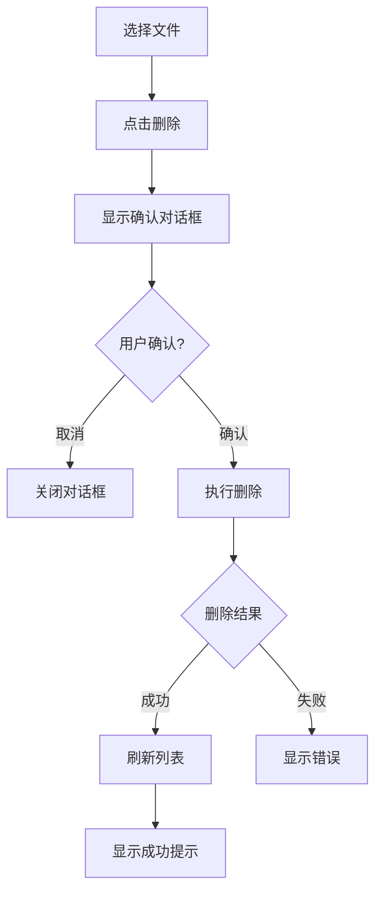
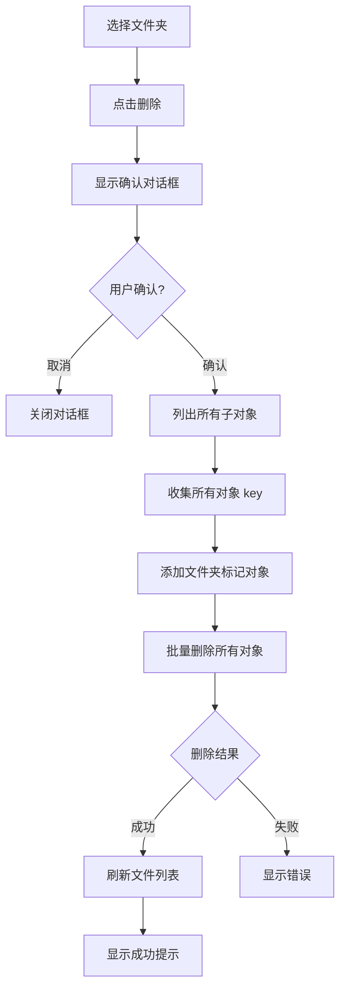

# 05. 文件下载、删除与重命名 (File Download, Delete & Rename)

## 功能概述

文件下载、删除与重命名模块提供从 R2 存储下载文件到本地、删除远程文件和重命名文件/文件夹的功能。支持单文件和批量操作。

## 核心组件

| 文件 | 职责 |
|------|-----|
| `FileListView.swift` | 下载/删除/重命名操作入口、批量操作 |
| `FilePreviewView.swift` | 文件预览视图 |
| `FileGridItemView.swift` | 网格视图文件项操作 |
| `FileTableView.swift` | 表格视图文件项操作 |
| `FinderToolbar.swift` | 批量操作工具栏 |
| `SelectionManager.swift` | 多选状态管理 |
| `RenameSheet.swift` | 重命名对话框组件 |
| `R2Service.swift` | 下载/删除/重命名 API |
| `DownloadQueueManager.swift` | 下载队列管理、进度追踪、任务去重 |

## 功能特性

### ✅ 已实现

- **文件预览**: 双击文件打开预览窗口
- **单文件下载**: 右键菜单或悬停按钮下载
- **批量下载**: 选择多个文件后批量下载到指定目录
- **文件夹下载**: 右键菜单下载整个文件夹，保持目录结构
- **下载位置选择**: 通过系统对话框选择保存位置
- **单文件删除**: 删除单个文件
- **批量删除**: 选择多个文件后批量删除（使用批量 API 优化）
- **删除确认**: 删除前显示确认对话框
- **文件重命名**: 右键菜单重命名文件
- **文件夹重命名**: 右键菜单重命名文件夹
- **操作反馈**: 成功/失败状态提示
- **多选支持**: Cmd+Click 添加选择，Shift+Click 范围选择
- **任务取消**: 支持取消进行中的下载任务
- **任务去重**: 自动跳过已在队列中的活跃任务
- **自动创建目录**: 下载时自动创建所需的本地目录结构

## 已知问题 / 改进方向

- **下载内存占用**：当前 `downloadObject` 会将对象一次性读入内存再写入磁盘，大文件可能导致内存飙升。后续需要改为流式读取/写入，逐块落盘。
- ✅ **目录占位符冲突**：已修复。下载 R2 文件夹时，不带尾斜杠的目录占位符对象会被自动过滤，避免与实际目录路径冲突（v1.0.1+）。

## 文件预览

### 触发方式

双击文件或通过右键菜单选择「预览」打开预览窗口。

### 支持的文件类型

| 类型 | 扩展名 | 预览方式 |
|------|--------|----------|
| **图片** | jpg, png, gif, webp, bmp, ico, svg | 图片视图（自适应缩放） |
| **视频** | mp4, mov, avi, mkv, webm | AVPlayer 播放器 |
| **音频** | mp3, wav, flac, aac, ogg, m4a | AVPlayer 播放器 |
| **PDF** | pdf | PDFKit 渲染 |
| **文本** | txt, md, json, xml, html, css, js, ts, swift 等 | 等宽字体文本显示 |

### 预览界面

```
┌─────────────────────────────────────────────────────────────┐
│ [图标] photo.jpg  2.3 MB · JPEG │  [◀] [▶]  │ [⬇] [🔗] [🗑] [✕] │
├─────────────────────────────────────────────────────────────┤
│                                                             │
│                                                             │
│                     [图片/视频/文档内容]                      │
│                                                             │
│                                                             │
└─────────────────────────────────────────────────────────────┘
```

### 工具栏功能

| 按钮 | 功能 |
|:----:|------|
| `◀` `▶` | 切换到上一个/下一个文件 |
| `⬇` | 下载文件到本地 |
| `🔗` | 复制公开链接到剪贴板 |
| `🗑` | 删除文件 |
| `✕` | 关闭预览 |

### 键盘快捷键

| 快捷键 | 功能 |
|--------|------|
| `←` | 上一个文件 |
| `→` | 下一个文件 |
| `Esc` | 关闭预览 |

## 文件下载

### 单文件下载

1. 右键点击文件或悬停显示下载按钮
2. 选择本地保存位置
3. 开始下载
4. 完成后显示成功提示

### 批量下载

1. 使用 Cmd+Click 或 Shift+Click 选择多个文件
2. 工具栏显示选中数量和批量操作按钮
3. 点击 **Download** 按钮
4. 选择保存目录
5. 所有文件下载到指定目录

### 文件夹下载

1. 右键点击文件夹，选择「下载」
2. 选择本地保存位置
3. 系统扫描文件夹内所有文件
4. **自动过滤目录占位符对象**（防止与实际目录冲突）
5. 自动创建本地目录结构
6. 批量下载所有文件到对应子目录

**目录结构保持**:

```
R2 存储桶:                          本地下载目录:
screenshots/                        ~/Downloads/screenshots/
├── blog/                    →      ├── blog/
│   ├── 2025/                       │   ├── 2025/
│   │   ├── cover.jpg               │   │   ├── cover.jpg
│   │   └── thumb.png               │   │   └── thumb.png
│   └── assets/                     │   └── assets/
│       └── logo.svg                │       └── logo.svg
```

**目录占位符过滤机制**:

某些 S3/R2 客户端工具会创建不带尾斜杠的目录占位符对象（如 `t1`、`t1/t2`），这些对象的 key 恰好等于其他文件路径中的目录前缀。下载时如果不过滤，会与实际目录路径冲突导致失败。

系统通过**两层防御机制**确保下载成功：

1. **列表阶段过滤**（`listAllFilesInFolder`）
   - 扫描完文件夹后，从所有文件的 relativePath 中提取目录前缀
   - 过滤掉 relativePath 恰好等于某个目录前缀的条目（即目录占位符）
   - 仅保留真正的文件对象

2. **下载阶段防御性检查**（`DownloadQueueManager`）
   - 下载前检查 localURL 是否已作为目录存在
   - 如果已存在同名目录，跳过下载（避免文件-目录冲突）

**示例**:

```
R2 对象列表（含占位符）:          过滤后（仅保留文件）:
vowels/t1 (0 bytes)  ← 占位符      vowels/t1/t2/carrier.mp3
vowels/t1/t2 (0 bytes) ← 占位符
vowels/t1/t2/carrier.mp3 (1024 bytes)
```

### 下载 API

```swift
// 普通下载（小文件）
func downloadObject(
    bucket: String,
    key: String,
    to localURL: URL
) async throws

// 分段下载（大文件，> 10MB）
func downloadObjectChunked(
    bucket: String,
    key: String,
    to localURL: URL,
    fileSize: Int64,
    progress: @escaping (Int64, Int64) -> Void
) async throws

// 列出文件夹内所有文件（自动过滤目录占位符）
func listAllFilesInFolder(
    bucket: String,
    folderPrefix: String
) async throws -> [(key: String, size: Int64, relativePath: String)]

// 过滤目录占位符对象（静态工具方法）
static func filterDirectoryPlaceholders(
    from files: [(key: String, size: Int64, relativePath: String)]
) -> [(key: String, size: Int64, relativePath: String)]
```

### 目录自动创建

下载文件时会自动创建所需的父目录：

```swift
// 下载前自动创建目录
let parentDirectory = localURL.deletingLastPathComponent()
try FileManager.default.createDirectory(
    at: parentDirectory,
    withIntermediateDirectories: true,
    attributes: nil
)
```

这确保了：
- 文件夹下载时，子目录结构会被正确创建
- 不会因为目录不存在而导致下载失败

## 文件删除

### 单文件删除



### 批量删除

1. 选择多个文件
2. 工具栏显示批量操作区
3. 点击 **Delete** 按钮
4. 确认对话框显示 "Delete N Files?"
5. 确认后依次删除所有选中文件
6. 显示删除结果统计

### 确认对话框

**单文件删除：**
```
Complete Deletion
Are you sure you want to delete 'example.txt'?
[Cancel] [Delete]
```

**批量删除：**
```
Delete 5 Files?
This action cannot be undone.
[Cancel] [Delete]
```

### 删除 API

```swift
// 删除单个对象
func deleteObject(bucket: String, key: String) async throws

// 批量删除对象（最多 1000 个，推荐用于多文件删除）
func deleteObjects(bucket: String, keys: [String]) async throws -> [String]

// 删除文件夹（递归删除所有内容，内部使用批量 API）
func deleteFolder(bucket: String, folderKey: String) async throws -> (deleted: Int, failed: [String])
```

### 批量删除优化

多选删除使用 S3 `DeleteObjects` 批量 API，一次请求最多删除 1000 个文件：

```swift
// 优化前：N 个文件 = N 次 API 调用（慢）
for file in files {
    try await r2Service.deleteObject(bucket: bucketName, key: file.key)
}

// 优化后：N 个文件 = 1 次 API 调用（快）
let fileKeys = files.map { $0.key }
let failedKeys = try await r2Service.deleteObjects(bucket: bucketName, keys: fileKeys)
```

**性能对比**：

| 文件数量 | 串行删除 | 批量删除 |
|---------|---------|---------|
| 10 个文件 | ~2-3 秒 | ~0.3 秒 |
| 100 个文件 | ~20-30 秒 | ~0.5 秒 |
| 1000 个文件 | ~3-5 分钟 | ~1 秒 |

## 文件夹删除

### 技术说明

R2/S3 使用扁平的键值存储结构，"文件夹"实际上是以 `/` 结尾的空对象（文件夹标记）加上共享相同前缀的一组对象。

### 删除流程



### 删除内容

文件夹删除会移除：
1. **所有子文件**: 文件夹内的所有文件
2. **所有子文件夹**: 递归删除嵌套的文件夹及其内容
3. **文件夹标记对象**: 以 `/` 结尾的空对象（表示文件夹本身）

### 确认对话框

**文件夹删除：**
```
确认删除
确定要删除文件夹 'documents' 吗？
此文件夹包含 15 个文件，删除后无法恢复。
[取消] [删除]
```

## 多选操作

### 选择模式

| 操作 | 快捷键 | 说明 |
|------|--------|------|
| 单选 | 点击 | 清除其他选择，只选中当前 |
| 添加选择 | Cmd + 点击 | 将文件添加/移除选择 |
| 范围选择 | Shift + 点击 | 选中从上次选择到当前的所有文件 |
| 全选 | Cmd + A | 选中当前目录所有文件 |
| 取消选择 | Esc 或点击空白 | 清除所有选择 |

### 批量操作工具栏

当有文件被选中时，工具栏中间区域会显示批量操作区：

```
[← ↻] ─────── [3 items selected | Download | Delete] ─────── [+ ↑ ≡ ⊞ ☰]
```

- **选中计数**: 显示 "N items selected"
- **Download**: 批量下载按钮
- **Delete**: 批量删除按钮（红色警示）

## 错误处理

| 错误类型 | 描述 | 处理方式 |
|---------|------|---------|
| `downloadFailed` | 下载请求失败 | 显示错误消息 |
| `deleteFileFailed` | 删除请求失败 | 显示错误消息 |
| `networkError` | 网络连接错误 | 建议重试 |
| `permissionDenied` | 权限不足 | 检查 API 权限 |

### 批量操作结果

批量操作完成后显示统计信息：

- **全部成功**: "Deleted Successfully - N files deleted"
- **部分失败**: "Partially Deleted - M succeeded, N failed"

## 文件重命名

### 触发方式

右键点击文件或文件夹，选择「重命名」菜单项。

### 重命名对话框

```
┌─────────────────────────────────────────┐
│              Rename                      │
│                                          │
│  New Name:                               │
│  ┌────────────────────────────────────┐ │
│  │ document.pdf                       │ │
│  └────────────────────────────────────┘ │
│  Names cannot contain: \ / : * ? " < > |│
│  ✓ Valid name                           │
│                                          │
│  [Cancel]                    [Rename]   │
└─────────────────────────────────────────┘
```

### 验证规则

| 规则 | 说明 |
|------|------|
| 非空 | 名称不能为空或仅包含空格 |
| 非法字符 | 不能包含 `\ / : * ? " < > \|` |
| 名称变化 | 新名称必须与原名称不同 |

### 验证状态提示

| 状态 | 颜色 | 说明 |
|------|------|------|
| ✓ Valid name | 绿色 | 名称有效且与原名不同 |
| Name unchanged | 橙色 | 名称与原名相同 |
| Invalid name | 红色 | 包含非法字符 |

### 键盘快捷键

| 快捷键 | 功能 |
|--------|------|
| `Enter` | 确认重命名 |
| `Esc` | 取消操作 |

### 重命名 API

```swift
func renameObject(
    bucket: String,
    oldKey: String,
    newKey: String
) async throws
```

**实现原理**: R2/S3 不支持原生重命名，通过 Copy + Delete 实现：
1. 复制对象到新 key
2. 删除原对象

### Key 构建逻辑

重命名时需要保留原有的目录路径：

**文件重命名**:
```swift
// 原 key: "documents/reports/old.pdf"
// 新名称: "new.pdf"
// 新 key: "documents/reports/new.pdf"
```

**文件夹重命名**:
```swift
// 原 key: "projects/2024/reports/"
// 新名称: "documents"
// 新 key: "projects/2024/documents/"
```

注意：文件夹 key 以 `/` 结尾，处理时需要先去除再添加。

### 错误处理

| 错误类型 | 描述 | 处理方式 |
|---------|------|---------|
| `renameFailed` | 重命名请求失败 | 显示错误消息 |
| `copyFailed` | 复制对象失败 | 显示错误消息 |
| `networkError` | 网络连接错误 | 建议重试 |

## 测试覆盖

### 目录占位符过滤测试 (`R2ServiceTests.swift`)

| 测试用例 | 描述 |
|---------|------|
| `testFilterDirectoryPlaceholders_removesPlaceholdersWithoutTrailingSlash` | 验证过滤掉不带尾斜杠的目录占位符（如 `t1`、`t1/t2`） |
| `testFilterDirectoryPlaceholders_preservesLegitimateFiles` | 验证保留所有真实文件 |
| `testFilterDirectoryPlaceholders_emptyList` | 验证空列表处理 |
| `testFilterDirectoryPlaceholders_singleFile` | 验证单文件场景 |
| `testFilterDirectoryPlaceholders_deepNestedPlaceholderChain` | 验证深层嵌套的占位符链 |
| `testFilterDirectoryPlaceholders_similarNameNotFalselyFiltered` | 验证相似名称文件不会被误过滤（如 `t1.txt` vs `t1`） |
| `testFilterDirectoryPlaceholders_multipleSubdirectories` | 验证多个子目录各自的占位符处理 |

### 下载目录创建测试 (`R2ServiceTests.swift`)

| 测试用例 | 描述 |
|---------|------|
| `testDownloadDirectoryCreation_parentDirectoryCreatedWhenNeeded` | 验证下载前自动创建嵌套目录 |
| `testDownloadDirectoryCreation_existingDirectoryNotAffected` | 验证已存在目录不受影响 |
| `testDownloadDirectoryCreation_multiLevelNestedPath` | 验证多层嵌套路径创建 |
| `testDownloadDirectoryCreation_fileCanBeCreatedAfterDirectorySetup` | 验证目录创建后文件能正确写入 |

**运行测试**:

```bash
# 运行所有 R2Service 相关测试
xcodebuild test -scheme OwlUploader -destination 'platform=macOS' \
  -only-testing:OwlUploaderTests/R2ServiceTests

# 运行目录占位符过滤测试
xcodebuild test -scheme OwlUploader -destination 'platform=macOS' \
  -only-testing:OwlUploaderTests/R2ServiceTests/testFilterDirectoryPlaceholders_removesPlaceholdersWithoutTrailingSlash
```

## 相关链接

- [文件导航](./03-file-navigation.md)
- [文件上传](./04-file-upload.md)
- [Finder UI 设计规范](./09-finder-ui-design.md)
