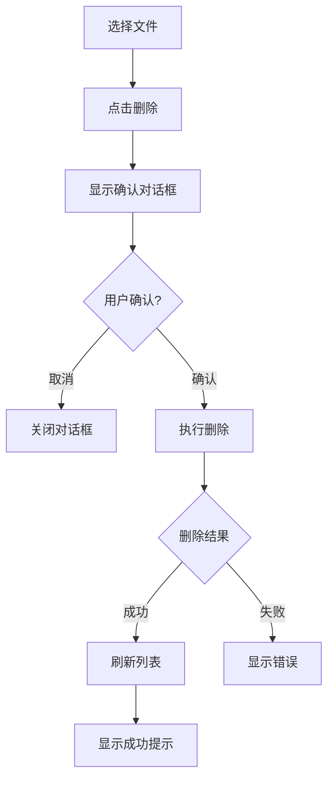

# 05. 文件下载与删除 (File Download & Delete)

## 功能概述

文件下载与删除模块提供从 R2 存储下载文件到本地，以及删除远程文件的功能。

## 核心组件

| 文件 | 职责 |
|------|-----|
| `FileListView.swift` | 下载/删除操作入口 |
| `FileListItemView.swift` | 文件项操作按钮 |
| `R2Service.swift` | 下载/删除 API |

## 功能特性

### ✅ 已实现

- **文件下载**: 下载单个文件到本地
- **下载位置选择**: 通过系统对话框选择保存位置
- **文件删除**: 删除单个文件或文件夹
- **删除确认**: 删除前显示确认对话框
- **操作反馈**: 成功/失败状态提示

## 文件下载

### 下载流程

1. 右键点击文件或点击下载按钮
2. 选择本地保存位置
3. 开始下载
4. 完成后显示成功提示

### 下载 API

```swift
func downloadFile(
    key: String, 
    to localURL: URL
) async throws
```

## 文件删除

### 删除流程



### 确认对话框

```
确认删除？
确定要删除文件 'example.txt' 吗？此操作无法撤销。
[取消] [删除]
```

### 删除 API

```swift
func deleteFile(key: String) async throws
```

## 批量操作

> ⚠️ **待实现**: 当前版本不支持批量下载和批量删除。

### 计划功能

- [ ] 多选文件
- [ ] 批量下载
- [ ] 批量删除
- [ ] 删除进度显示

## 错误处理

| 错误类型 | 描述 | 处理方式 |
|---------|------|---------|
| `downloadFailed` | 下载请求失败 | 显示错误消息 |
| `deleteFileFailed` | 删除请求失败 | 显示错误消息 |
| `networkError` | 网络连接错误 | 建议重试 |
| `permissionDenied` | 权限不足 | 检查 API 权限 |

## 相关链接

- [文件导航](./03-file-navigation.md)
- [文件上传](./04-file-upload.md)
