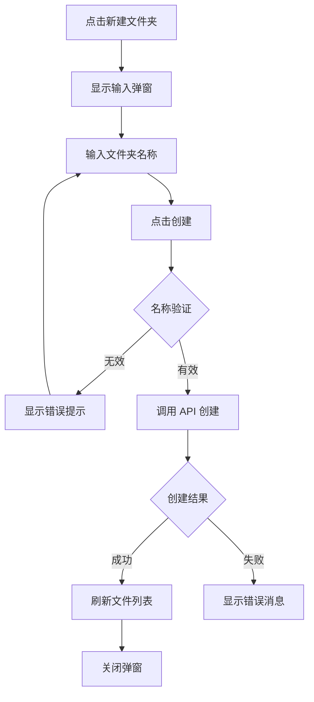

# 06. 文件夹管理 (Folder Management)

## 功能概述

文件夹管理模块允许用户在当前目录下创建新的文件夹，用于组织和管理 R2 存储中的文件结构。

## 核心组件

| 文件 | 职责 |
|------|-----|
| `FileListView.swift` | 新建文件夹按钮入口 |
| `CreateFolderSheet.swift` | 创建文件夹弹窗 UI |
| `R2Service.swift` | 文件夹创建 API |

## 功能特性

### ✅ 已实现

- **创建文件夹**: 在当前目录创建新文件夹
- **名称输入**: 输入框输入文件夹名称
- **名称验证**: 验证文件夹名称合法性
- **自动刷新**: 创建成功后自动刷新列表
- **错误提示**: 创建失败时显示详细错误

## 用户界面

### 创建文件夹弹窗

```
┌─────────────────────────────────────┐
│           新建文件夹                 │
├─────────────────────────────────────┤
│                                     │
│  文件夹名称:                         │
│  ┌─────────────────────────────┐    │
│  │ my-new-folder               │    │
│  └─────────────────────────────┘    │
│                                     │
│  将创建于: /documents/              │
│                                     │
├─────────────────────────────────────┤
│              [取消]  [创建]          │
└─────────────────────────────────────┘
```

## 创建流程



## 名称验证规则

### 禁止字符
以下字符不允许用于文件夹名称：
- `<` `>` `:` `"` `|` `?` `*` `/` `\`

### 禁止名称
Windows 系统保留名称（不区分大小写）：
- `CON`, `PRN`, `AUX`, `NUL`
- `COM1` - `COM9`
- `LPT1` - `LPT9`

### 其他限制
- 名称不能为空
- 名称不能只包含空格
- 名称前后空格会被自动去除

## API 实现

### 创建文件夹
```swift
func createFolder(name: String, at prefix: String) async throws
```

S3/R2 中文件夹通过创建一个以 `/` 结尾的空对象来表示：

```swift
// 实际创建的对象 key
let folderKey = "\(prefix)\(name)/"
```

## 错误类型

| 错误 | 描述 |
|------|-----|
| `createFolderFailed` | 创建文件夹失败 |
| `invalidFolderName` | 文件夹名称无效 |
| `folderAlreadyExists` | 文件夹已存在 |
| `networkError` | 网络连接错误 |

## 相关链接

- [文件导航](./03-file-navigation.md)
- [文件上传](./04-file-upload.md)
