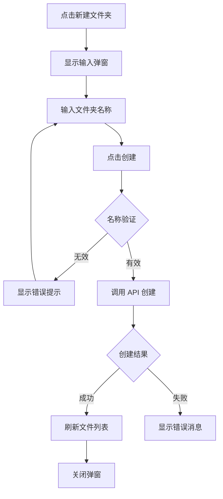
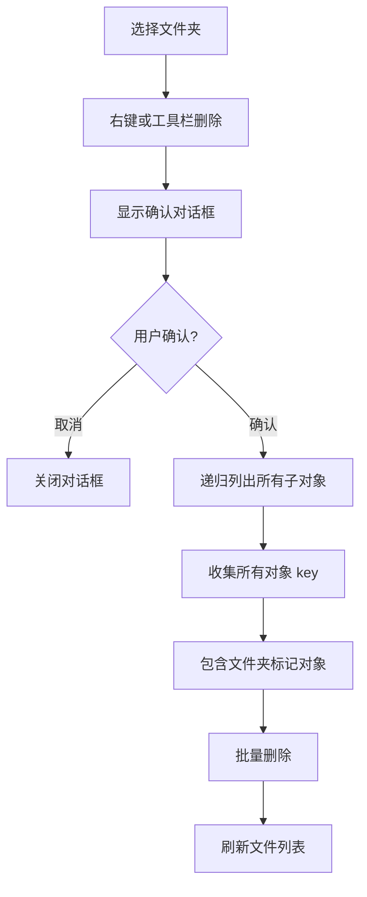
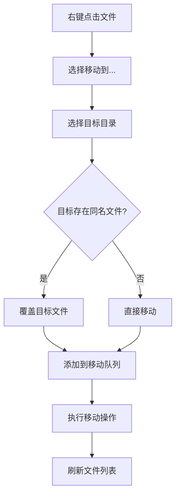

# 06. 文件夹管理 (Folder Management)

## 功能概述

文件夹管理模块允许用户在当前目录下创建新的文件夹，用于组织和管理 R2 存储中的文件结构。

## 核心组件

| 文件 | 职责 |
|------|-----|
| `FileListView.swift` | 新建文件夹按钮入口 |
| `CreateFolderSheet.swift` | 创建文件夹弹窗 UI |
| `R2Service.swift` | 文件夹创建 API |

## 功能特性

### ✅ 已实现

- **创建文件夹**: 在当前目录创建新文件夹
- **名称输入**: 输入框输入文件夹名称
- **名称验证**: 验证文件夹名称合法性
- **自动刷新**: 创建成功后自动刷新列表
- **错误提示**: 创建失败时显示详细错误

## 已知问题 / 改进方向

- **移动冲突处理**：当前当目标位置已存在同名文件夹时，会先删除目标文件夹再移动，存在误删目标目录现有内容的风险。需改为冲突提示或安全的合并/跳过策略，避免数据丢失。

## 用户界面

### 创建文件夹弹窗

```
┌─────────────────────────────────────┐
│           新建文件夹                 │
├─────────────────────────────────────┤
│                                     │
│  文件夹名称:                         │
│  ┌─────────────────────────────┐    │
│  │ my-new-folder               │    │
│  └─────────────────────────────┘    │
│                                     │
│  将创建于: /documents/              │
│                                     │
├─────────────────────────────────────┤
│              [取消]  [创建]          │
└─────────────────────────────────────┘
```

## 创建流程



## 名称验证规则

### 禁止字符
以下字符不允许用于文件夹名称：
- `<` `>` `:` `"` `|` `?` `*` `/` `\`

### 禁止名称
Windows 系统保留名称（不区分大小写）：
- `CON`, `PRN`, `AUX`, `NUL`
- `COM1` - `COM9`
- `LPT1` - `LPT9`

### 其他限制
- 名称不能为空
- 名称不能只包含空格
- 名称前后空格会被自动去除

## API 实现

### 创建文件夹
```swift
func createFolder(name: String, at prefix: String) async throws
```

S3/R2 中文件夹通过创建一个以 `/` 结尾的空对象来表示：

```swift
// 实际创建的对象 key
let folderKey = "\(prefix)\(name)/"
```

## 文件夹删除

### 删除流程



### 技术实现

R2/S3 中文件夹是"虚拟"的，由两部分组成：
1. **文件夹标记**: 以 `/` 结尾的空对象（如 `documents/`）
2. **文件夹内容**: 共享相同前缀的对象（如 `documents/file.txt`）

删除文件夹时必须同时删除：
- 所有子对象（文件和嵌套文件夹）
- 文件夹标记对象本身

### 删除 API

```swift
func deleteFolder(bucket: String, prefix: String) async throws {
    // 1. 列出所有以 prefix 开头的对象
    // 2. 确保包含文件夹标记对象（prefix 本身）
    // 3. 批量删除所有对象
}
```

## 文件/文件夹移动

通过右键菜单可以将文件或文件夹移动到其他目录。

### 触发方式

1. 右键点击文件或文件夹
2. 选择「移动到...」菜单
3. 从子菜单中选择目标目录
4. 确认移动操作

### 移动目标选项

| 选项 | 说明 |
|------|------|
| 根目录 | 移动到存储桶根目录 |
| 上级目录 | 移动到当前目录的父目录 |
| 同级文件夹 | 移动到当前目录下的其他文件夹 |

### 移动流程



### 核心组件

| 文件 | 职责 |
|------|------|
| `Queue/MoveQueueManager.swift` | 移动队列管理 |
| `Queue/CombinedQueueView.swift` | 合并队列 UI |
| `R2Service.swift` | 移动 API 实现 |

### API 实现

```swift
// 移动单个对象
func moveObject(bucket: String, sourceKey: String, destinationKey: String) async throws

// 移动文件夹（递归移动所有内容）
func moveFolder(bucket: String, sourceFolderKey: String, destinationFolderKey: String) async throws -> Int
```

## 错误类型

| 错误 | 描述 |
|------|-----|
| `createFolderFailed` | 创建文件夹失败 |
| `invalidFolderName` | 文件夹名称无效 |
| `folderAlreadyExists` | 文件夹已存在 |
| `deleteFolderFailed` | 删除文件夹失败 |
| `moveFailed` | 移动文件/文件夹失败 |
| `networkError` | 网络连接错误 |

## 相关链接

- [文件导航](./03-file-navigation.md)
- [文件上传](./04-file-upload.md)
