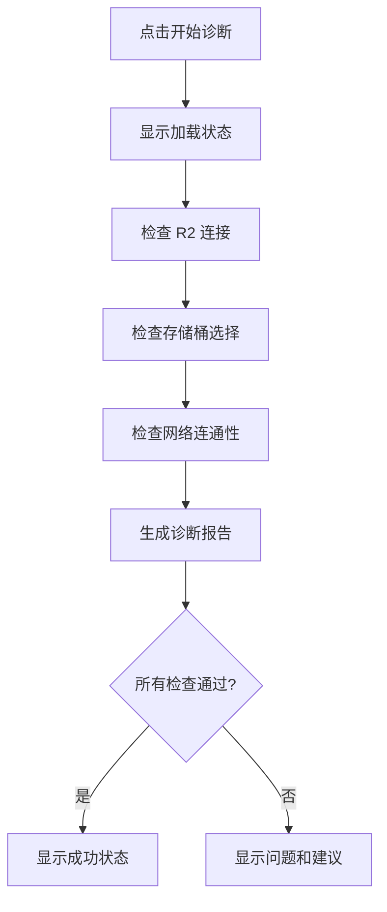

# 08. 系统诊断 (Diagnostics)

## 功能概述

系统诊断模块提供连接问题排查和上传功能诊断，帮助用户识别和解决常见问题。

## 核心组件

| 文件 | 职责 |
|------|-----|
| `DiagnosticsView.swift` | 诊断界面 UI |
| `R2Service.swift` | 诊断逻辑实现 |

## 功能特性

### ✅ 已实现

- **上传前置检查**: 验证上传功能所需条件
- **问题识别**: 自动识别常见配置问题
- **建议方案**: 提供针对性的解决建议
- **实时诊断**: 一键运行完整诊断

## 诊断项目

### 检查清单

| 检查项 | 描述 |
|-------|-----|
| R2 连接状态 | 是否已成功连接到 R2 服务 |
| 存储桶选择 | 是否已选择目标存储桶 |
| 网络连通性 | 是否能访问 R2 端点 |
| 凭证有效性 | API 凭证是否有效 |
| 权限检查 | 是否有上传/读取权限 |

## 用户界面

### 诊断结果界面

```
┌─────────────────────────────────────────┐
│              🛡️ 系统诊断                │
│                                         │
│  检查上传功能的前置条件和提供故障排除建议   │
├─────────────────────────────────────────┤
│                                         │
│  ⚠️ 发现问题需要解决                     │
│                                         │
│  发现的问题：                            │
│  ┌─────────────────────────────────┐   │
│  │ • R2 服务未连接                   │   │
│  │ • 未选择存储桶                    │   │
│  └─────────────────────────────────┘   │
│                                         │
│  解决建议：                              │
│  ┌─────────────────────────────────┐   │
│  │ 1. 请前往账户设置配置 R2 凭证      │   │
│  │ 2. 连接成功后选择目标存储桶        │   │
│  └─────────────────────────────────┘   │
│                                         │
├─────────────────────────────────────────┤
│           [关闭]    [开始诊断]           │
└─────────────────────────────────────────┘
```

## 诊断流程



## API 方法

### 诊断上传问题

```swift
func diagnoseUploadIssues() -> (
    isReady: Bool, 
    issues: [String], 
    suggestions: [String]
)
```

### 网络诊断

```swift
private func performNetworkDiagnostics() async
```

## 错误类型与建议

### 连接错误

| 错误类型 | 描述 | 建议 |
|---------|-----|------|
| `connectionTimeout` | 连接超时 | 检查网络连接 |
| `dnsResolutionFailed` | DNS 解析失败 | 验证端点 URL |
| `sslCertificateError` | SSL 证书错误 | 确认使用 HTTPS |
| `endpointNotReachable` | 端点不可达 | 检查 URL 格式 |

### 认证错误

| 错误类型 | 描述 | 建议 |
|---------|-----|------|
| `invalidCredentials` | 凭证无效 | 重新输入凭证 |
| `authenticationError` | 认证失败 | 验证 Access Key |
| `accountNotConfigured` | 账户未配置 | 前往账户设置 |

## 成功状态

当所有检查通过时显示：

```
✅ 上传功能就绪

所有检查项目均通过：
• R2 服务连接正常
• 存储桶已选择
• 网络连接正常
• 具有上传权限

现在可以正常上传文件。
```

## 相关链接

- [账户配置](./01-account-configuration.md)
- [安全存储](./07-security-keychain.md)
