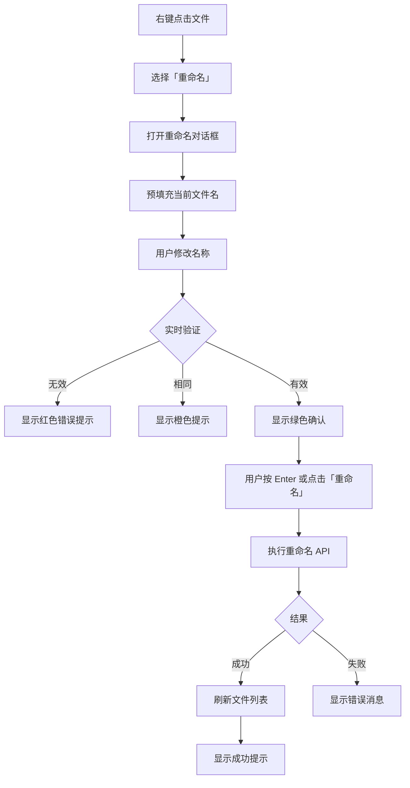

# 10. 文件重命名 (File Rename)

## 功能概述

文件重命名模块提供对 R2 存储中的文件和文件夹进行重命名的功能。支持智能验证、实时反馈和键盘快捷键操作。

## 核心组件

| 文件 | 职责 |
|------|-----|
| `RenameSheet.swift` | 重命名弹窗组件 |
| `FileListView.swift` | 重命名操作触发与协调 |
| `FileGridView.swift` | 网格视图重命名入口 |
| `FileTableView.swift` | 表格视图重命名入口 |
| `FileGridItemView.swift` | 网格项右键菜单 |
| `R2Service.swift` | 重命名 API 实现 |

## 功能特性

### ✅ 已实现

- **右键菜单重命名**: 通过右键菜单触发重命名
- **智能验证**: 实时检查文件名有效性
- **非法字符检测**: 阻止包含非法字符的文件名
- **重复名称检测**: 提示用户名称未更改
- **文件夹支持**: 支持重命名文件夹（自动处理尾部斜杠）
- **实时反馈**: 彩色状态提示（绿色=有效，橙色=相同，红色=无效）
- **键盘快捷键**: Enter 确认，Esc 取消
- **自动聚焦**: 弹窗打开时自动聚焦输入框
- **操作反馈**: 成功/失败消息通知

## 触发方式

### 右键菜单

1. 在文件列表中右键点击文件或文件夹
2. 选择「重命名」(Rename) 选项
3. 弹出重命名对话框

```
┌──────────────────────┐
│ ✓ Preview            │
│ ⬇ Download           │
│ 🗑 Delete            │
│ ➜ Move to...         │
│ ✏️ Rename            │  ← 新增选项
│ ──────────────────── │
│ ℹ️ Info              │
└──────────────────────┘
```

## 重命名对话框

### 界面布局

```
┌─────────────────────────────────────────────┐
│                   重命名文件                  │
│                                              │
│  名称 (Name)                                 │
│  ┌─────────────────────────────────────┐    │
│  │ example.txt                         │    │
│  └─────────────────────────────────────┘    │
│                                              │
│  不允许使用的字符: \ / : * ? " < > |         │
│  ✓ 名称有效                                  │
│                                              │
│  [取消]                      [重命名] ⏎      │
└─────────────────────────────────────────────┘
```

### 字段说明

| 元素 | 说明 |
|------|------|
| **标题** | "重命名文件" / "Rename File" |
| **名称输入框** | 预填充当前文件名，支持直接编辑 |
| **提示文本** | 显示不允许的非法字符 |
| **验证状态** | 实时显示名称有效性（彩色文本） |
| **取消按钮** | 关闭对话框，不保存更改 (Esc) |
| **重命名按钮** | 确认重命名 (Enter) |

## 名称验证规则

### S3/R2 对象键命名规则

S3 对象键禁止使用以下字符：

```
\ / : * ? " < > |
```

### 验证逻辑

```swift
private var isValidName: Bool {
    let trimmedName = newName.trimmingCharacters(in: .whitespacesAndNewlines)
    
    // 1. 不能为空
    guard !trimmedName.isEmpty else { return false }
    
    // 2. 不能包含非法字符
    let illegalCharacters = CharacterSet(charactersIn: "\\/:*?\"<>|")
    let hasIllegalChars = trimmedName.rangeOfCharacter(from: illegalCharacters) != nil
    
    return !hasIllegalChars
}
```

### 验证状态提示

| 状态 | 颜色 | 消息 | 说明 |
|------|------|------|------|
| **有效** | 🟢 绿色 | "名称有效" | 可以重命名 |
| **相同** | 🟠 橙色 | "名称未更改" | 与原名称相同 |
| **无效** | 🔴 红色 | "名称包含非法字符" | 包含禁用字符 |
| **空** | 灰色 | (无提示) | 输入框为空 |

### 按钮状态

重命名按钮启用条件：

```swift
private var canRename: Bool {
    return isValidName && hasChanges && !isRenaming
}
```

- ✅ 名称有效
- ✅ 名称已更改
- ✅ 未在重命名中

## 重命名流程

### 文件重命名



### 文件夹重命名

文件夹重命名流程与文件相同，但会自动处理尾部斜杠：

1. **原名称处理**: 移除尾部 `/` 显示给用户
2. **新名称处理**: 自动添加尾部 `/` 保持文件夹标识
3. **键路径保留**: 保持原有目录结构

```swift
// 示例：重命名文件夹 "documents/" -> "docs/"
let directory = file.key.components(separatedBy: "/").dropLast().joined(separator: "/")
let newKey = directory.isEmpty ? newName : "\(directory)/\(newName)"
let finalNewKey = file.isDirectory ? "\(newKey)/" : newKey

// 结果：
// 原 key: "projects/documents/"
// 新 key: "projects/docs/"
```

## 重命名 API

### R2Service.renameObject

```swift
/// 重命名对象（文件或文件夹）
/// - Parameters:
///   - bucket: 存储桶名称
///   - oldKey: 原始对象键
///   - newKey: 新对象键
/// - Throws: 重命名失败错误
func renameObject(
    bucket: String,
    oldKey: String,
    newKey: String
) async throws
```

### 实现原理

S3/R2 不支持原生的「重命名」操作，重命名通过以下步骤实现：

1. **复制对象**: 使用 `CopyObject` API 将对象复制到新键
2. **删除原对象**: 使用 `DeleteObject` API 删除原键

```swift
// 1. 复制到新键
let copyRequest = CopyObjectInput(
    bucket: bucket,
    copySource: "/\(bucket)/\(oldKey)",
    key: newKey
)
try await client.copyObject(input: copyRequest)

// 2. 删除原键
let deleteRequest = DeleteObjectInput(
    bucket: bucket,
    key: oldKey
)
try await client.deleteObject(input: deleteRequest)
```

### 原子性保证

- 复制成功后才删除原对象
- 如果复制失败，原对象保持不变
- 如果删除失败，会显示错误但新对象已创建

## 键盘快捷键

| 快捷键 | 功能 |
|--------|------|
| `Enter` | 确认重命名 |
| `Esc` | 取消并关闭对话框 |

快捷键在对话框打开时自动生效，无需额外配置。

## 操作反馈

### 成功消息

```
✓ 重命名成功
文件 'old-name.txt' 已重命名为 'new-name.txt'
```

### 失败消息

```
✗ 重命名失败
[错误详细信息]
```

常见错误：
- 网络连接失败
- 权限不足
- 对象不存在
- 新名称已存在（会覆盖）

## 使用场景

### 修正文件名

用户上传文件后发现文件名有误，可以直接重命名而无需重新上传。

### 文件夹组织

批量重命名文件夹以优化存储结构。

### 版本管理

为文件添加版本标识：
- `document.pdf` → `document-v2.pdf`

## 限制说明

### 目录结构限制

- 重命名**不会**移动文件到不同目录
- 仅修改文件/文件夹的名称部分
- 目录路径保持不变

```
// ✅ 支持
原: "projects/app/main.swift"
新: "projects/app/index.swift"

// ❌ 不支持（请使用「移动」功能）
原: "projects/app/main.swift"
新: "archive/app/main.swift"
```

### 覆盖警告

如果新名称与现有对象冲突，S3/R2 会**静默覆盖**现有对象。当前版本不检测冲突，未来可能添加冲突检测。

## 错误处理

| 错误类型 | 描述 | 处理方式 |
|---------|------|---------|
| `renameFailed` | 重命名请求失败 | 显示错误消息，保留对话框 |
| `networkError` | 网络连接错误 | 建议检查网络并重试 |
| `permissionDenied` | 权限不足 | 检查 API Token 权限 |
| `objectNotFound` | 原对象不存在 | 可能已被删除，刷新列表 |

## 本地化支持

重命名功能支持中英文双语：

| 英文 (EN) | 中文 (ZH) |
|-----------|-----------|
| Rename | 重命名 |
| Name | 名称 |
| Invalid characters | 不允许使用的字符 |
| Name is valid | 名称有效 |
| Name contains invalid characters | 名称包含非法字符 |
| Name hasn't changed | 名称未更改 |
| Cancel | 取消 |
| Rename succeeded | 重命名成功 |
| Renamed 'X' to 'Y' | 文件 'X' 已重命名为 'Y' |

所有文本通过 `AppStrings.swift` 统一管理，使用 `Localizable.xcstrings` 提供翻译。

## 未来优化

### 计划中

- [ ] **冲突检测**: 检测目标名称是否已存在，显示覆盖警告
- [ ] **批量重命名**: 支持选择多个文件批量重命名（模式替换）
- [ ] **撤销功能**: 撤销最近的重命名操作
- [ ] **快捷键触发**: F2 快捷键直接触发重命名（无需右键）
- [ ] **内联编辑**: 在文件列表中直接编辑文件名（类似 Finder）

## 相关链接

- [文件导航](./03-file-navigation.md)
- [文件下载与删除](./05-file-download-delete.md)
- [文件夹管理](./06-folder-management.md)
- [Finder UI 设计规范](./09-finder-ui-design.md)
